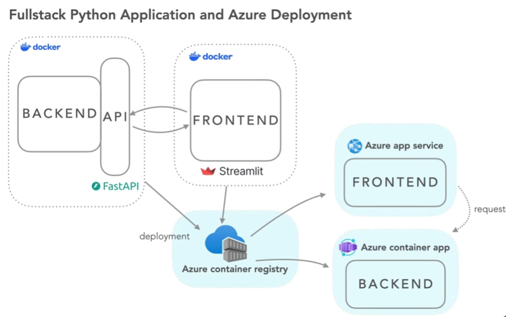
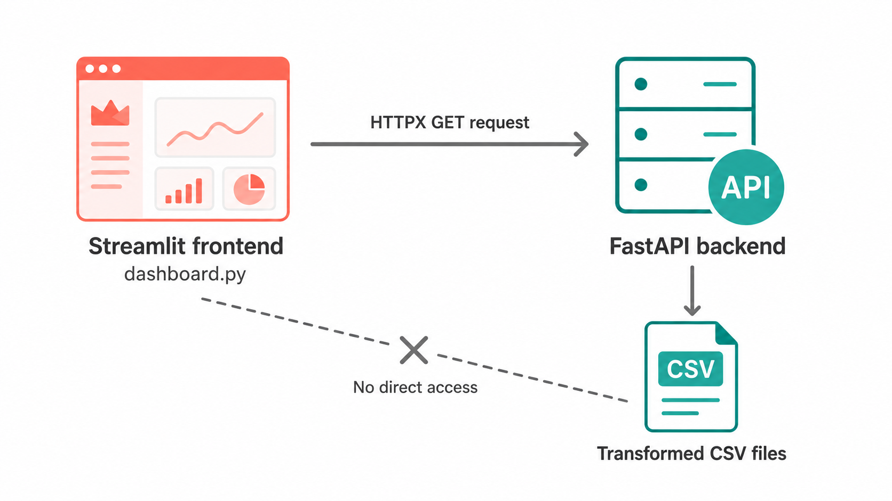
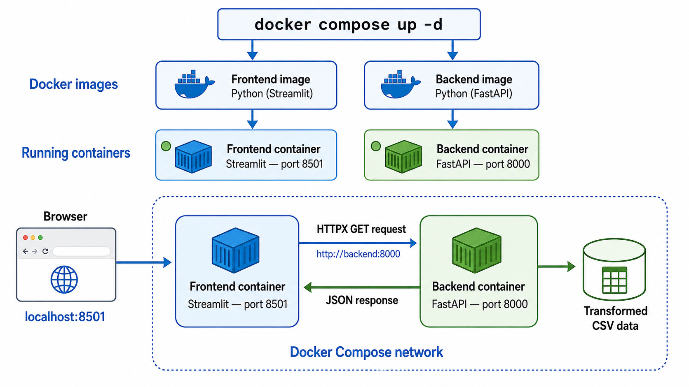

# Azure python fullstack lab
Show knowledge in Python, FastAPI,  Streamlit as well as Docker and Azure to build deployable fullstack application.

## Project overview
eClipseBord displays solar and lunar eclipse data in a web dashboard. The project uses transformed CSV data, a FastAPI backend, and a Streamlit frontend.



## Dataset
https://www.kaggle.com/datasets/nasa/solar-eclipses?resource=download

## Main features

- Filter eclipse records by year.
- Filter records by eclipse category.
- Switch between Solar and Lunar views.

## Data transformation

The notebooks in `eda/` use pandas to prepare the raw CSV files. They add a numeric `Year` column from `Calendar Date` and an `Eclipse Category` column that turns eclipse type codes into clear category names. The results are saved in `backend/data/transformed/`.

## Technology stack

- Python and pandas for data preparation and filtering
- FastAPI for the API
- Streamlit and HTTPX for the dashboard and API requests
- Docker and Docker Compose for containers
- Azure as the lab's deployment target
- Terraform is not currently included in this repository

## Application architecture




FastAPI loads the transformed solar and lunar CSV files. Streamlit requests the records from FastAPI and shows the filters and tables.

## Repository structure

Separate pyproject.toml files are created because each part of the project has a different responsibility and different dependencies.

```text
azure_python_fullstack_lab/
├── backend/
│   ├── data/
│   │   ├── raw/
│   │   └── transformed/
│   └── src/backend/
│        └── pyproject.toml            
│
├── frontend/
│   └── src/frontend/
│       └── pyproject.toml
│
├── eda/
├── dockerfiles/
│       ├── backend.dockerfile
│       └── frontend.dockerfile
│
├── documentation/
├── docker-compose.yaml
├── pyproject.toml
└── README.md
```
| File                      | Reason                                                                                                                                                                        |
| ------------------------- | ------------------------------------------------------------------------------------------------------------------------------------------------------------------------------ |
| Root `pyproject.toml`     | Manages the whole project as a **uv workspace** and lists `backend` and `frontend` as members. It can also hold shared development tools such as Jupyter and testing packages. |
| `backend/pyproject.toml`  | Contains only backend dependencies, such as FastAPI, Uvicorn, and pandas.                                                                                                      |
| `frontend/pyproject.toml` | Contains only frontend dependencies, such as Streamlit, httpx, and pandas.                                                                                                     |


- Backend runs FastAPI on port `8000`.
- Frontend runs Streamlit on port `8501`.
- Each container installs only the packages it needs.
- You can deploy, update, or troubleshoot one service without affecting the other.
- The root file lets you run and manage everything together during local development.

----

## Documentations
[Set up](documentation/set_up.md)
[Running app locally](documentation/run_app.md)